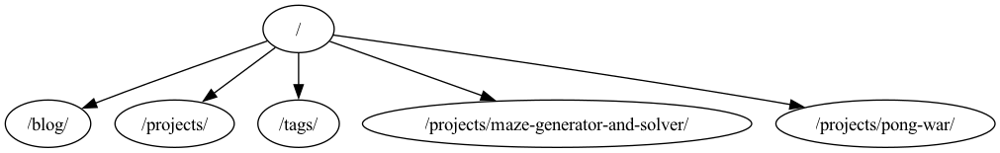

# Web Crawler

This is web crawler project from boot.dev backend course. The project is written in Javascript. The crawler generates a report to show internal linking profile and outputs a csv file with the results. The crawler also generates a image showing the first calls to any path thus showing a internal site map.

The project is built using Node.js.

## Installation

To run the project, you need to have Node.js installed. You can use [NVM](https://github.com/nvm-sh/nvm) to manage your node environment. Alternatively, you can also download it directly from [here](https://nodejs.org/en/).

After installing Node.js, you can clone the repository and install the dependencies using the following commands:

```bash
cd boot.dev-projects/11.web-crawler-html5-js
npm install
```

## Usage

To start crawling a website, use the following command. Replace `<BASE_URL>` with the website you wish to crawl.

```bash
npm run start -- --url <BASE_URL> [options]
```

Here is a list of options you can use to customize the behavior of the crawler:

- `--url` (required): Specifies the base URL of the website to start crawling from.
- `--depth` (optional): Sets the maximum depth to crawl. Defaults to `20`.
- `--bfs` (optional): Enables breadth-first search instead of the default depth-first search. Defaults to `false`.
- `--userAgent` (optional): Defines the user agent string to use for requests. Defaults to `"Mozilla/5.0 (compatible; Crawlbot/1.0;)"`.
- `--help`: Displays the help menu with a list of available options.
- `--version`: Shows the version number of the web crawler application.


## Testing

To run the tests, you can use the following command:

```bash
npm run test
```

## Example output

The project generates a csv file with the internal linking profile and a image showing the first calls to any path thus showing a internal site map. The csv file and the image are saved in the `output` folder.

Following is an example of the csv file:

```csv
Page,Visits
1-ashraful-islam.github.io,40
1-ashraful-islam.github.io/tags,32
1-ashraful-islam.github.io/projects/maze-generator-and-solver,24
1-ashraful-islam.github.io/blog,17
1-ashraful-islam.github.io/projects,17
1-ashraful-islam.github.io/projects/pong-war,11
```

Following is an example of the generated image:
[](output/graph.png)

## License

This project is licensed under the MIT License - see the [LICENSE](../LICENSE) file for details.
