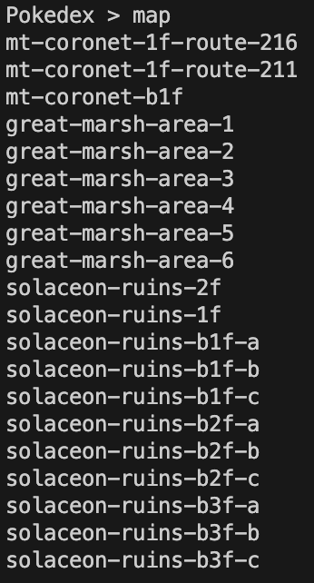
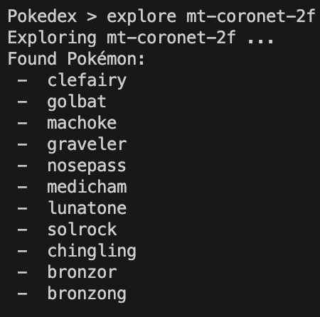
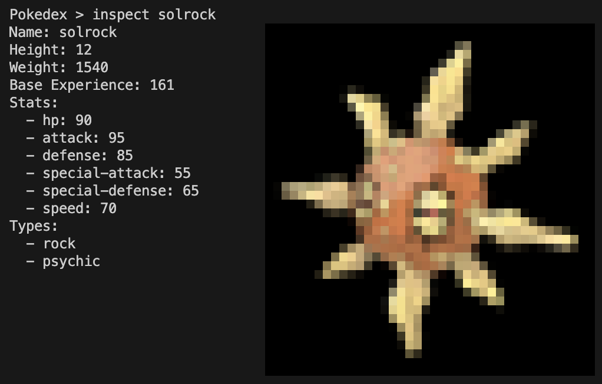

# Pokedex CLI in GO

Yet another Pokedex CLI in GO. This is a simple CLI application that allows you to explore the Pokémon world, catch Pokémon, and inspect them. It uses the [PokéAPI](https://pokeapi.co/) to fetch the data.

## Build and Run

```bash
go build -o pokedex && ./pokedex
```

## Usage

```bash
./pokedex
```

then at the prompt, you can type additional commands:

Usages:

Command | Description
---|---
map | Displays the names of 20 location areas in the Pokémon world.
mapb | Displays the names of previous 20 location areas in the Pokémon world.
explore | Explore a location area for all the Pokémon species
catch | Catch a Pokémon
inspect | Inspect a Pokémon
pokedex | Displays all the Pokémon caught
help | Displays help message
exit | Exits the program

## Screenshots







